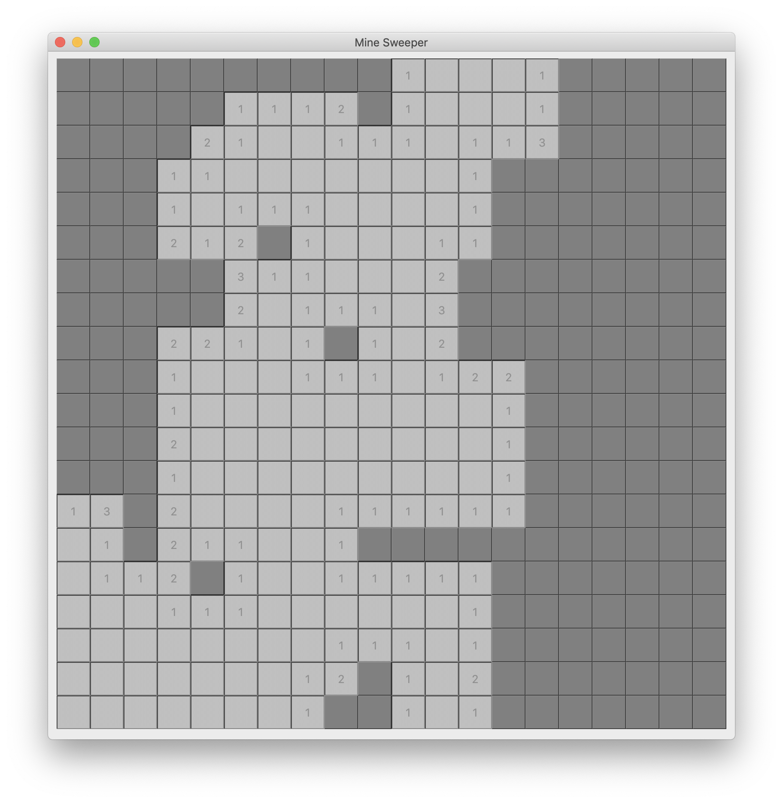
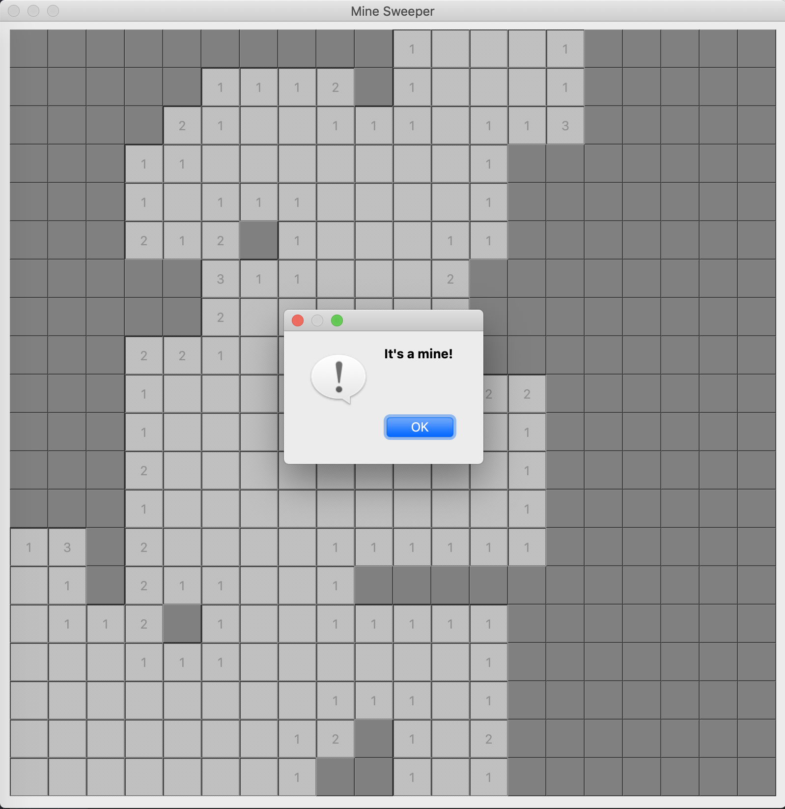
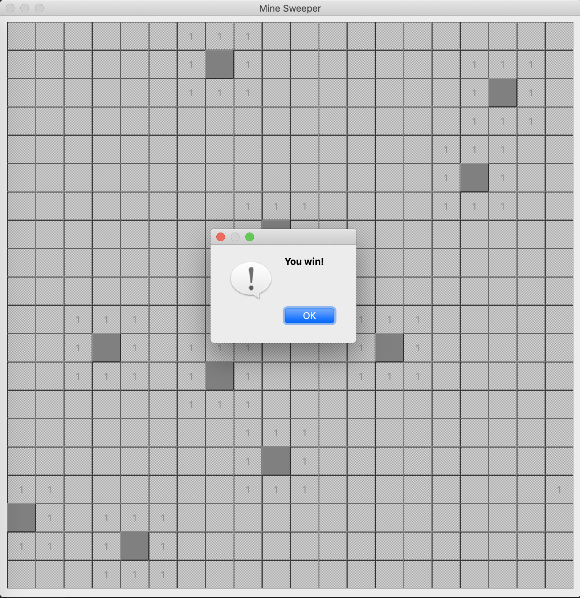

# MineSweeper
Date: Mar 26, 2020

Version: 1.1.0

**Description:** MineSweeper Implemented in Pytq5. It's designed for sweeper algorithm development.

**Environments:** Mac OS X Mojave 10.14.16, Python 3.7

**Requirements:** pyqt5

**Product Previews:** 

